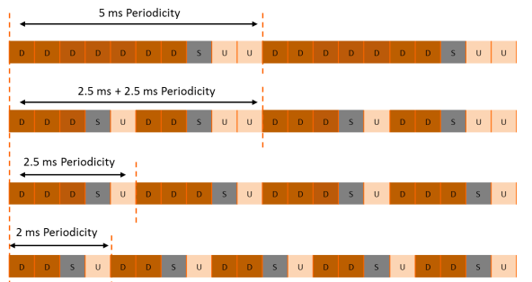

# SU-Projects

## 1. KPM Monitoring

The KPM (Key Performance Metrics) Monitoring project aligns with the 5G measurements defined by O-RAN and 3GPP TS 28.552 specifications.

### Supported Measurements from 3GPP TS 28.552
- `DRB.PdcpSduVolumeDL`
- `DRB.PdcpSduVolumeUL`
- `DRB.RlcSduDelayDl`
- `DRB.UEThpDl`
- `DRB.UEThpUl`
- `RRU.PrbTotDl`
- `RRU.PrbTotUl`

### Setup Instructions

#### Compile FlexRIC
```bash
git clone https://gitlab.eurecom.fr/mosaic5g/flexric
cd flexric
git checkout develop
mkdir build && cd build && cmake .. && make -j8 && sudo make install
mkdir build && cd build && cmake -DXAPP_MULTILANGUAGE=OFF .. && make -j8 && sudo make install # if SWIG not installed
```

#### Compile OAI
```bash
git clone https://gitlab.eurecom.fr/oai/openairinterface5g
cd openairinterface5g
git checkout develop
cd cmake_targets
./build_oai -c -C -w SIMU --gNB --nrUE --build-e2 --ninja
```

#### Start the Core Network
```bash
cd cn
docker compose -f docker-compose.yml up -d
```

#### Start gNB-mono
```bash
cd openairinterface5g/cmake_targets/ran_build/build
sudo ./nr-softmodem -O <path-to/SU-Projects/conf/gnb.conf> --sa --rfsim -E
```

#### Start nearRT-RIC
```bash
cd flexric/build/examples/ric
./nearRT-RIC
```

#### Start UE
```bash
cd openairinterface5g/cmake_targets/ran_build/build
sudo LD_LIBRARY_PATH=. ./nr-uesoftmodem --rfsimulator.serveraddr 10.201.1.100 -r 106 --numerology 1 --band 78 -C 3619200000 --rfsim --sa -O <path-to/oai-workshops/oam/conf/slicing_demo/ue_1.conf> -E
```

#### Start the KPM monitor xApp
Run measurements as per [3.1.1 E2SM-KPM](#311-e2sm-kpm) for each UE that matches S-NSSAI criteria.
```bash
cd flexric
./build/examples/xApp/c/monitor/xapp_kpm_moni
```

#### Ping from UE to External Networks
```bash
ping -I oaitun_ue1 8.8.8.8 -i 0.001
```

#### Start iperf3 Server on `oai-ex-dn` (in the Core Network) for Uplink Testing
```bash
docker exec -it oai-ext-dn iperf3 -s
```

#### Connect to iperf3 Server from the UE
```bash
iperf3 -B <IP_of_the_UE_in_oaitun_ue1> -c 192.168.70.135 
```

For Downlink Testing, use the `-R` option:
```bash
docker exec -it oai-nr-ue iperf3 -B <IP_of_the_UE_in_oaitun_ue1> -c 192.168.70.135 -R
```

### Expected Output
The output from the KPM xApp should resemble:
```plaintext
UE ID type = gNB, amf_ue_ngap_id = 1
ran_ue_id = 1
DRB.PdcpSduVolumeDL = 79 [kb]
DRB.PdcpSduVolumeUL = 80 [kb]
DRB.RlcSduDelayDl = 37.27 [μs]
DRB.UEThpDl = 88.32 [kbps]
DRB.UEThpUl = 97.43 [kbps]
RRU.PrbTotDl = 1170 [PRBs]
RRU.PrbTotUl = 2237 [PRBs]
```

### Next Steps: Adding a New Measurement
1. Familiarize with the KPM xApp example:
   - File: `flexric/examples/xApp/c/monitoring/xapp_kpm_moni.c`
2. Explore KPM SM in OAI:
   - Path: `openairinterface/openair2/E2AP/RAN_FUNCTION-ORAN/`
3. Review current measurements:
   - File: `openairinterface/openair2/E2AP/RAN_FUNCTION-ORAN/ran_func_kpm_subs.c`
4. Create a new measurement by modifying:
   - Files: `ran_func_kpm_subs.c`, `ran_func_kpm.c`, and `xapp_kpm_moni.c`

## 2. TDD Configuration for Low-Latency

Time Division Duplexing (TDD) configuration allows for optimizing latency in the network. Below are the instructions to configure TDD for low-latency scenarios.

### Compile OAI
```bash
git clone https://gitlab.eurecom.fr/oai/openairinterface5g
cd openairinterface5g
git checkout develop
cd cmake_targets
./build_oai -c -C -w SIMU --gNB --nrUE --build-e2 --ninja
```

### TDD Configuration Modifications
All the important modifications are gathered in the table below:


The configuration file can be found under the `confs/tdd_ran_confs` directory of the repo.

### Example TDD Configurations

**For 2.5ms TDD**

```
referenceSubcarrierSpacing = 1;
dl_UL_TransmissionPeriodicity = 5;
nrofDownlinkSlots = 3;
nrofDownlinkSymbols = 6;
nrofUplinkSlots = 1;
nrofUplinkSymbols = 4;
```

**For 2ms TDD**

```
referenceSubcarrierSpacing = 1;
dl_UL_TransmissionPeriodicity = 4;
nrofDownlinkSlots = 2;
nrofDownlinkSymbols = 6;
nrofUplinkSlots = 1;
nrofUplinkSymbols = 4;
```

Changing the transmission periodicity for TDD will allow you to get lower latency values.



In TDD, the transmission is divided into time domain, meaning at one moment of time either "D" (downlink subframe) is transmitted or "U" (uplink subframe). The "S" (special subframe) comes when there is a transition from downlink to uplink.

- **For higher throughput**: The frame structure should contain a high number of consecutive Downlinks (D).
- **For higher uplink data**: The frame structure should contain a high number of consecutive Uplinks (U).
- **For lower latency and better coverage**: The frame structure should have a lower number of consecutive Downlinks (D) and Uplinks, with more frequent switching. More frequent switching decreases throughput.

### Validation
You can validate the settings by trying to ping the UPF and observing how these settings affect the latency components.

- Ensure the following in the MACRLC section of the configuration file for the UL max frame inactivity:
  ```bash
  ulsch_max_frame_inactivity=0;
  ```
  This guarantees UL is scheduled in every TDD period with the minimal UL allocation (5 PRBs by default, MCS 9). You might want to increase this minimal allocation to something like:
  ```bash
  min_grant_prb = 20;
  min_grant_mcs = 16;
  ```

- Modify the `sl_ahead` in the RU section: It should be 5 for 2.5 ms and 4 for 2 ms.

### Running the Softmodems
Before running the softmodems, ensure the following:

- The MCC, MNC, TAC (tracking_area_code), and S-NSSAI (SST and SD) parameters should be the same as the values in the core configuration files.
- To configure the connection between the core and the gNB, set the correct AMF parameters (`amf_ip_address`) to the address of the AMF and the correct network interfaces (`NETWORK_INTERFACES`).

#### Start the Core Network
```bash
cd cn
docker compose -f docker-compose.yml up -d
```

#### Start gNB-mono
```bash
cd openairinterface5g/cmake_targets/ran_build/build
sudo ./nr-softmodem -O <path-to/SU-Projects/conf/gnb.conf> --sa --rfsim -E
```

#### Start UE
```bash
cd openairinterface5g/cmake_targets/ran_build/build
sudo LD_LIBRARY_PATH=. ./nr-uesoftmodem --rfsimulator.serveraddr 10.201.1.100 -r 106 --numerology 1 --band 78 -C 3619200000 --rfsim --sa -O <path-to/oai-workshops/oam/conf/slicing_demo/ue_1.conf> -E
```

#### Ping from UE to External Networks
```bash
ping -I oaitun_ue1 8.8.8.8 -i 0.001
```

#### Start iperf3 Server on `oai-ex-dn` (in the Core Network) for Uplink Testing
```bash
docker exec -it oai-ext-dn iperf3 -s
```

#### Connect to iperf3 Server from the UE
```bash
iperf3 -B <IP_of_the_UE_in_oaitun_ue1> -c 192.168.70.135 
```

For Downlink Testing, use the `-R` option:
```bash
docker exec -it oai-nr-ue iperf3 -B <IP_of_the_UE_in_oaitun_ue1> -c 192.168.70.135 -R
```

### Observations
Experiment with the ping command and iperf. For the ping, use the `-i` option. You can also use the KPM xApp from the KPM Monitoring project.


## 3. Slicing

Two slices will be created as follows:
- **Slice 1**: SST=1, SD=1
- **Slice 2**: SST=1, SD=5

### Instructions

#### Start the Core Network
```bash
cd slicing-cn
docker compose -f docker-compose-slicing-basic-nrf.yaml up -d
```

#### Compile FlexRIC
```bash
git clone https://gitlab.eurecom.fr/mosaic5g/flexric
cd flexric
git checkout slicing-spring-of-code
mkdir build && cd build && cmake .. && make -j8 && sudo make install
mkdir build && cd build && cmake -DXAPP_MULTILANGUAGE=OFF .. && make -j8 && sudo make install # if SWIG not installed
```

#### Compile OAI
```bash
git clone https://gitlab.eurecom.fr/oai/openairinterface5g
cd openairinterface5g
git checkout slicing-spring-of-code
cd cmake_targets
./build_oai -c -C -w SIMU --gNB --nrUE --build-e2 --ninja
```

#### Start nearRT-RIC
```bash
cd flexric/build/examples/ric
./nearRT-RIC
```

#### Start gNB-mono
```bash
cd openairinterface5g/cmake_targets/ran_build/build
sudo ./nr-softmodem -O <path-to/SU-Projects/conf/slicing/gnb.conf> --sa --rfsim -E
```

#### Start UE #1
```bash
cd openairinterface5g/cmake_targets/ran_build/build
sudo <path-to/SU-Projects/conf/slicing/multi-ue.sh> -c1 -e  # create namespace
sudo LD_LIBRARY_PATH=. ./nr-uesoftmodem --rfsimulator.serveraddr 10.201.1.100 -r 106 --numerology 1 --band 78 -C 3619200000 --rfsim --sa -O <path-to/SU-Projects/conf/slicing/ue1.conf> -E
```

#### Start UE #2
```bash
cd openairinterface5g/cmake_targets/ran_build/build
sudo <path-to/SU-Projects/conf/slicing/multi-ue.sh> -c2 -e  # create namespace
sudo LD_LIBRARY_PATH=. ./nr-uesoftmodem --rfsimulator.serveraddr 10.202.1.100 -r 106 --numerology 1 --band 78 -C 3619200000 --rfsim --sa -O <path-to/SU-Projects/conf/slicing/ue2.conf> -E
```

#### Start KPM xApp (Optional, for Throughput Validation)
```bash
cd flexric/build/examples/xApp/c/monitor
./xapp_kpm_moni
```

#### Start iperf for UE #1
1. Terminal #1 (UE):
   ```bash
   sudo ip netns exec ue1 bash
   ifconfig  # get UE IP address on interface oaitun_ue1
   iperf3 -i1 -s
   ```
2. Terminal #2 (Core Network):
   ```bash
   cd <path-to/oai-cn5g-fed/docker-compose>
   docker exec -t oai-ext-dn iperf3 -c <UE-IP-address> -t60 -B 192.168.70.145 -i1
   ```

#### Start iperf for UE #2
1. Terminal #3 (UE):
   ```bash
   sudo ip netns exec ue2 bash
   ifconfig  # get UE IP address on interface oaitun_ue1
   iperf3 -i1 -s
   ```
2. Terminal #4 (Core Network):
   ```bash
   cd <path-to/oai-cn5g-fed/docker-compose>
   docker exec -t oai-ext-dn iperf3 -c <UE-IP-address> -t60 -B 192.168.70.145 -i1
   ```

The throughput should show a 50/50 split between UEs.

#### Start RC xApp
```bash
cd flexric/build/examples/xApp/c/ctrl
./xapp_rc_slice_ctrl
```

Expected log output from gNB-mono:
```plaintext
[NR_MAC]   [E2-Agent]: RC CONTROL rx, RIC Style Type 2, Action ID 6
[NR_MAC]   Add default DL slice id 99, label default, sst 0, sd 0, slice sched algo NVS_CAPACITY, pct_reserved 0.05, ue sched algo nr_proportional_fair_wbcqi_dl
[NR_MAC]   configure slice 0, label SST1SD1, Min_PRB_Policy_Ratio 0
[NR_MAC]   configure slice 0, label SST1SD1, Dedicated_PRB_Policy_Ratio 70
[NR_MAC]   add DL slice id 1, label SST1SD1, slice sched algo NVS_CAPACITY, pct_reserved 0.66, ue sched algo nr_proportional_fair_wbcqi_dl
[NR_MAC]   Matched slice, Add UE rnti 0x1013 to slice idx 0, sst 0, sd 0
[NR_MAC]   Matched slice, Add UE rnti 0x1013 to slice idx 1, sst 1, sd 1
[NR_MAC]   configure slice 1, label SST1SD5, Min_PRB_Policy_Ratio 0
[NR_MAC]   configure slice 1, label SST1SD5, Dedicated_PRB_Policy_Ratio 30
[NR_MAC]   add DL slice id 2, label SST1SD5, slice sched algo NVS_CAPACITY, pct_reserved 0.28, ue sched algo nr_proportional_fair_wbcqi_dl
[NR_MAC]   Matched slice, Add UE rnti 0x9b7f to slice idx 0, sst 0, sd 0
[NR_MAC]   Matched slice, Add UE rnti 0x9b7f to slice idx 2, sst 1, sd 5
[E2-AGENT]: CONTROL ACKNOWLEDGE tx
[NR_MAC]   Frame.Slot 896.0
```

The throughput of 100 Mbps is split 70/30% between UEs. You can run iperf again to verify that the throughput remains divided 70/30%.
